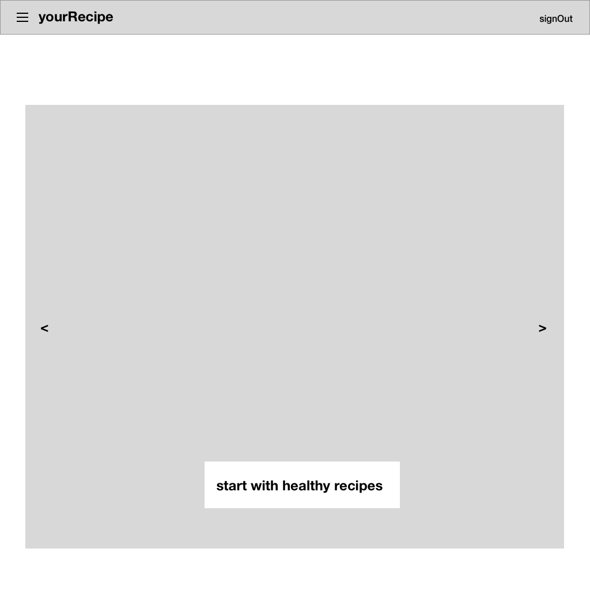

## SEI-23 Project 2 – yourRecipe 

<a href="https://sei23yourrecipe.herokuapp.com/">yourRecipe app</a>

### Problem Statement
This app is for the community to share / source for recipes and add to their grocery shopping list. 

### MVP
- User sign in and log out
- User to access all routes
- User to view and add recipes

### Furthers
- Improve UI 
- Enable edit & delete function 
- User profile
- Check-list like UI for each recipe
- e-suggestion box to admin

### Approach & Process
- Homepage signIn / signUp / signOut
 
  

- Dashboard / List of recipes
 

- Create recipe
 

### Code snippet
 
 

### Technologies used
- NodeJS
- Express, EJS
- Passport
- MongoDB
- Heroku
- Cloudinary, Multer

#### Authors & Acknowledgment
- Robert Mion's <a href="https://codeburst.io/full-stack-adventure-weekly-meal-prep-with-a-custom-blue-apron-recipe-api-d8ff4b29bc39">inspiration story</a>
- <a href="https://www.myrecipes.com/">myrecipes.com</a>
- Guru Schenecke's <a href="https://git.generalassemb.ly/ebere/restaurant_nodejs">restaurant nodejs</a>
- Guru Schenecke's <a href="https://github.com/guru-schnecke/challenge_sg_c">Save the Seniors of As Salamah, Jeddah</a>
